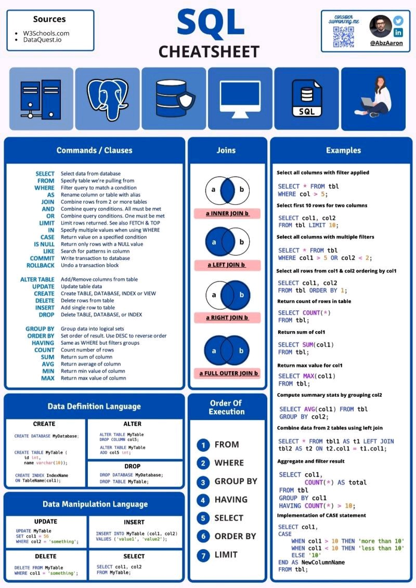

# My-SQL-All-Basic

>Sample Database for practice : <a href = "https://github.com/harsha547/ClassicModels-Database-Queries/blob/master/database.sql" target="_blank" > Click Here </a>

What is Table ? 
A table is a Database object that is composed of rows and columns and contains related data. 

What is Field ? 
A field is a column in a table that is supposed to provide specific information about all the records in the table. 

What is a Record ? 
A record is a row in a table. It is also known as a Horizontal entity of a table.

What is Null value ? 
A null is neither an empty string nor a zero value.

What is Data ? 
Data is defined as facts or figures, or information that's stored in or used by a computer.

What is Data in perspective of SQL? 
Data is a collection of information in a row and column format or it refers to all the single items that are stored in a database, either individually or as a set.

What is DataType? 
A DataType is a property that specifies the type of data you can put in your table.

What is Database ? 
A database is a systematic collection of data where each row reflects a data entity, and every column defines a specific information field.

What is SQL ?  
SQL stands for ‘Structured Query Language’. It is the most common programming language used for executing queries, and handling data by using CRUD (create, read, update and delete) operation on a Relational Database Management System (RDMS) like MySQL, PostgreSQL.

What is MySQL ? 
MySQL is a relational database management system (RDBMS) developed by Oracle that is based on structured query language (SQL).

What is MySQL Aliases ?  
Aliases in MySQL is used to give a temporary name to a table or a column in a table for the purpose of a particular query.

What is the difference between DROP and TRUNCATE ? 
DROP command is used to remove the whole database or table. Whereas the TRUNCATE command is used to remove all the rows from the table.

what is the difference between DELETE and TRUNCATE ? 
 The DELETE command in SQL removes one or more rows from a table based on the conditions specified in those rows whereas TRUNCATE command is used to remove all the rows from the table whether or not any conditions are met. 
 
 > Ex of DELETE : delete from students where id = 1; 
 
 > Ex of TRUNCATE : truncate table students;  
 
 >Ex of DROP : drop table students; 
 
What is DDL commands ? 
DDL commands are used to define the structure of the database, table, schemas, etc. It enables us to perform the operations like 
 > CREATE
 
 >DROP
 
 >ALTER
 
 >RENAME
 
 >TRUNCATE 

What is DML commands ? 
DML commands are used to make changes in the database, such as: CRUD operations to create, read, update, and delete data. Using the 
>INSERT 
 
 >SELECT 

 >UPDATE
 
 >Delete 
 
What is Constraints in SQL ? 
SQL constraints are used to specify rules for the data in a table. Constraints are used to limit the type of data that can go into a table. Following are the types of constraints in SQL

>NOT NULL - Ensures that a column cannot have a NULL value
 
>UNIQUE - Ensures that all values in a column are different
 
>PRIMARY KEY - Uniquely identifies each row in a table
 
>FOREIGN KEY - Prevents actions that would destroy links between tables
 
>CHECK - Ensures that the values in a column satisfies a specific condition
 
>DEFAULT - Sets a default value for a column if no value is specified
 
>CREATE INDEX - Used to create and retrieve data from the database very quickly

 
 
What is Stored Procedure ?  
A stored procedure is a prepared SQL code that you can save, so the code can be reused over and over again.

What is the diference between Primary key and Foreign key?
A primary key generally focuses on the uniqueness of the table. It assures the value in the specific column is unique. A foreign key is generally used to build a relationship between the two tables. Table allows only one primary key.

What is the difference between Char and Varchar? 
CHAR is a fixed length field; VARCHAR is a variable length field. If you are storing strings with a wildly variable length such as names, then use a VARCHAR, if the length is always the same, then use a CHAR because it is slightly more size-efficient.

What is the difference between Primary key and Unique key? 
Primary key will not accept NULL values whereas Unique key can accept NULL values. A table can have only one primary key whereas there can be multiple unique key on a table.
 
 What is SQL Joins ? 
 A SQL JOIN clause is used to combine rows from two or more tables, based on a related column between them. 
 
>INNER JOIN: Returns records that have matching values in both tables  
 
>LEFT JOIN: Returns all records from the left table, and the matched records from the right table 
 
>RIGHT JOIN: Returns all records from the right table, and the matched records from the left table 
 
>CROSS JOIN: Returns all records from both tables 

 <a href="https://intellipaat.com/blog/tutorial/sql-tutorial/" target="_blank">Further blogs on SQL :</a>

 
what is ER Modeling ? 
 Entity Relationship Model (ER Modeling) is a graphical approach to database design. It is a high-level data model that defines data elements and their relationship for a specified software system. An ER model is used to represent real-world objects.
 
 what is where clause ? 
 WHERE Clause in MySQL is a keyword used to specify the exact criteria of data or rows that will be affected by the specified SQL statement. The WHERE clause can be used with SQL statements like INSERT, UPDATE, SELECT, and DELETE to filter records and perform various operations on the data.

What is Order by cluase ? 
  The MySQL ORDER BY clause is used to sort the query result sets in either ascending or descending order.

 what is group by clause ? 
 The GROUP BY clause is a SQL command that is used to group rows that have the same values. 
 
 What is IS NULL and NOT NULL ? 
 “IS NULL” is the keyword that performs the Boolean comparison. It returns true if the supplied value is NULL and false if the supplied value is not NULL. 
“NOT NULL” is the keyword that performs the Boolean comparison. It returns true if the supplied value is not NULL and false if the supplied value is null.

 What is Auto Increment ? 
 Auto Increment is a function that operates on numeric data types. It automatically generates sequential numeric values every time that a record is inserted into a table for a field defined as auto increment.

 what is ALTER function ? 
 MySQL provides the ALTER function that helps us incorporate the changes to the already existing database design.

what is LIMIT keyword ? 
 The limit keyword is used to limit the number of rows returned in a query result.

what is Sub qury in SQL ? 
 A sub query is a select query that is contained inside another query. The inner select query is usually used to determine the results of the outer select query.

what is UNION ? 
 Unions combine the results from multiple SELECT queries into a consolidated result set.

 what is View? 
 VIEWS are virtual tables that do not store any data of their own but display data stored in other tables.

 what is the difference between trigger and stored procedure ? 
 The key distinction between the trigger and procedure is that a trigger is called automatically when a data modification event occurs against a table. A stored procedure, on the other hand, must be invoked directly.
